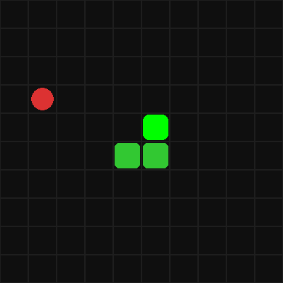

# Snake DQN

Snake agent trained with Dueling Double DQN in a custom Gymnasium environment.
Built from scratch using PyTorch — reaches score 20+ on a 10×10 grid after 10 000 episodes.



## Algorithm
- **Dueling Double DQN** — separates state value V(s) and action advantage A(s,a)
- **4-channel state**: body, head, food, danger zones
- **Replay Buffer** — 100 000 transitions
- **Reward shaping** — distance-based reward + progress bonus

## Network Architecture

Input (4 × 10 × 10)
→ Conv2d(4→32) → Conv2d(32→64) → Conv2d(64→64)
→ Linear(6400→512)
→ Value head: Linear(512→256→1)
→ Advantage head: Linear(512→256→4)
→ Q(s,a) = V(s) + A(s,a) - mean(A)

## Results
| Episodes | Best Score |
|----------|------------|
| 1 000    | 9          |
| 5 000    | 19         |
| 10 000   | 20+        |

## Run
```bash
pip install torch gymnasium pygame imageio numpy

python Train.py    # train the agent
python record.py   # record snake.gif
```

## Files
| File | Description |
|------|-------------|
| `Snake.py` | Custom Gymnasium environment |
| `DQN.py` | Dueling DQN network |
| `Memory.py` | Replay buffer |
| `Train.py` | Training loop |
| `record.py` | Record GIF of trained agent |
